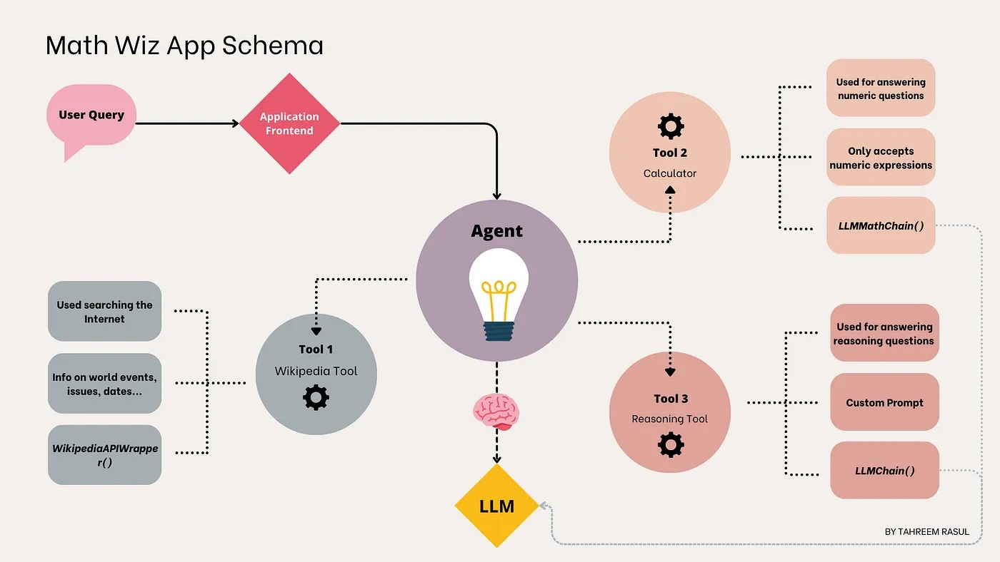

# Composition



Higher-level components that combine other arbitrary systems and/or or LangChain primitives together

## Tools
Interfaces that allow an LLM to interact with external systems

Tools are interfaces that an agent, chain, or LLM can use to interact with the world. They combine a few things:

1. The name of the tool
1. A description of what the tool is
1. JSON schema of what the inputs to the tool are
1. The function to call
1. Whether the result of a tool should be returned directly to the user

It is useful to have all this information because this information can be used to build action-taking systems! The name, description, and JSON schema can be used to prompt the LLM so it knows how to specify what action to take, and then the function to call is equivalent to taking that action.

The simpler the input to a tool is, the easier it is for an LLM to be able to use it. Many agents will only work with tools that have a single string input. For a list of agent types and which ones work with more complicated inputs, please see this documentation

Importantly, the name, description, and JSON schema (if used) are all used in the prompt. Therefore, it is really important that they are clear and describe exactly how the tool should be used. You may need to change the default name, description, or JSON schema if the LLM is not understanding how to use the tool.


```python
# Python Example
from langchain.tools import Tool

# Define a simple function to be triggered by the agent
def greet(name):
    return f"Hello, {name}!"

# Wrap the function in a Tool
greet_tool = Tool(
    name="greet",
    func=greet,
    description="Greets the user with their name. Use this tool when the input starts with 'greet <name>'."
)

# Load tools (in this case, only the greet tool)
tools = [greet_tool]
```


```js
// JavaScript Example
import { DynamicTool } from "@langchain/core/tools";

// Define a simple function to be triggered by the agent
function greet(name) {
    return `Hello, ${name}!`;
}

// Wrap the function in a DynamicTool (Tool has some problems in javascript)
const greetTool = new DynamicTool({
    name: "greet",
    description: "Greets the user with their name. Use this tool when the input starts with 'greet <name>'.",
    func: greet,
});

// Load tools (in this case, only the greet tool)
const tools = [greetTool]

```

## Agents
Constructs that choose which tools to use given high-level directives

The core idea of agents is to use a language model to choose a sequence of actions to take. In chains, a sequence of actions is hardcoded (in code). In agents, a language model is used as a reasoning engine to determine which actions to take and in which order.

- **Definition**: Autonomous entities that use LLMs to make decisions and perform tasks.
- **Types**:

    - **Action Agents**: Execute specific actions based on model outputs.
    - **Planning Agents**: Create plans or sequences of actions to achieve a goal.

- **Components**:

    - **Toolkits**: Collections of tools or APIs that agents can use.
    - **Memory**: Mechanisms for maintaining context or state across interactions.

- **Examples**: 

  ```python
  # Python Example
  from langchain import hub
  from langchain_openai import ChatOpenAI
  from langchain.agents import create_react_agent, AgentExecutor
  from langchain.tools import Tool

  # Initialize the ChatOpenAI model
  llm = ChatOpenAI(openai_api_key=your_openai_api_key)

  # Define a simple function to be triggered by the agent
  def greet(name):
      return f"Hello, {name}!"

  # Wrap the function in a Tool
  greet_tool = Tool(
      name="greet",
      func=greet,
      description="Greets the user with their name. Use this tool when the input starts with 'greet <name>'."
  )

  # Load tools (in this case, only the greet tool)
  tools = [greet_tool]

  # Define a prompt template for the agent to decide when to call the function
  prompt = hub.pull("hwchase17/react")

  # Create a React agent to handle the function triggering
  agent = create_react_agent(llm=llm, tools=tools, prompt=prompt)
  agent_executor = AgentExecutor(
      agent=agent, tools=tools, verbose=True
  )

  # Define the user input
  input_text = "greet John"

  # Use the agent to process the input and perform actions
  response = agent_executor.invoke(
    {
        "input": input_text
    }
  )

  # Print the response
  print("Agent Response:")
  print(response["output"])

  ```


  ```js
  import { pull } from "langchain/hub";
  import { ChatOpenAI } from "@langchain/openai";
  import { AgentExecutor, createReactAgent } from "langchain/agents"
  import { DynamicTool } from "langchain/tools";


  // Initialize the ChatOpenAI model
  const llm = new ChatOpenAI({ openAIApiKey: yourOpenAiApiKey })


  // Define a simple function to be triggered by the agent
  function greet(name) {
      return `Hello, ${name}!`;
  }

  // Wrap the function in a Tool
  const greetTool = new DynamicTool({
      name: "greet",
      description: "Greets the user with their name. Use this tool when the input starts with 'greet <name>'.",
      func: greet,
  });

  // Load tools (in this case, only the greet tool)
  const tools = [greetTool]

  // Define a prompt template for the agent to decide when to call the function
  const prompt = await pull("hwchase17/react");


  // Create a React agent to handle the function triggering
  const agent = await createReactAgent({
      llm,
      tools,
      prompt,
  });

  const agentExecutor = new AgentExecutor({
      agent,
      tools: [greetTool],
  });


  // Define the user input
  const inputText = "greet John"


  // Use the agent to process the input and perform actions

  const result = await agentExecutor
    .invoke({ "input": inputText })

  console.log(result.output)
  ```

   **Input**: 

  ```
  greet John
  ```

 **Output**: 

  ```
  Hello, John!
  ```

## Chains
Building block-style compositions of other runnables

- **Definition**: Sequences of operations where the output of one step serves as the input for the next.
- **Types**:

    - **Simple Chains**: Involve a single call to a language model.
    - **Complex Chains**: Involve multiple steps and can include logic and decision-making.

- **Components**:
  
    - **Links**: Individual steps or operations in the chain.
    - **Flow Control**: Logic that dictates the order and conditions under which steps are executed.

- **Examples**: 


```python
# Python Example
from langchain.prompts import PromptTemplate
from langchain_openai import OpenAI

# Initialize the OpenAI model
llm = OpenAI(openai_api_key=your_openai_api_key)

prompt_template = PromptTemplate(
    template="Use a maximum of 10 words to answer the following question. If you don't know the answer, just say that you don't know.  {question}",
    input_variables=["question"],
)

# Create a chain with the model and the prompt template
chain = prompt_template | llm

# Define the user's question
question = "What are the key benefits of using blockchain technology in supply chain management?"

# Generate a response using the chain
response = chain.invoke({"question": question})

print(response)
```

```js
import { OpenAI } from "@langchain/openai";
import { PromptTemplate } from "@langchain/core/prompts"
import { RunnableSequence } from "@langchain/core/runnables";

// Initialize the OpenAI model
const llm = new OpenAI({ openAIApiKey: yourOpenAiApiKy })

const promptTemplate = new PromptTemplate({
    template: "Use a maximum of 10 words to answer the following question. If you don't know the answer, just say that you don't know.  {question}",
    inputVariables: ["question"],
})

// Create a chain with the model and the prompt template
const chain = RunnableSequence.from([promptTemplate, llm]);

// Define the user's question
const question = "What are the key benefits of using blockchain technology in supply chain management?"

// Generate a response using the chain
const result = await chain
    .invoke({ "question": question })

console.log(result)

```

 **Input**: 

  ```
  What are the key benefits of using blockchain technology in supply chain management?
  ```

 **Output**: 

  ```
 Increased transparency, efficiency, security, and traceability.
  ```