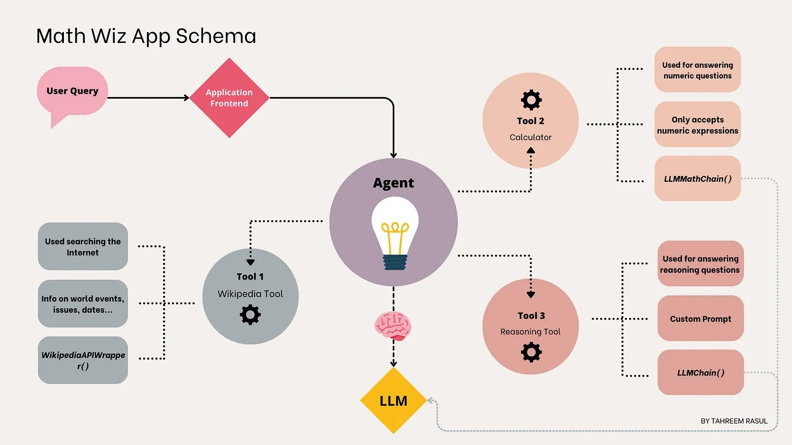

# Langchain main concepts

## [Model I/O](./model-io.md)

Formatting and managing language model input and output

- **Prompts** (format): Formatting for LLM inputs that guide generation

- **Chat models** (predict): Interfaces for language models that use chat messages as inputs and returns chat messages as outputs (as opposed to using plain text).

- **LLMs** (predict): Interfaces for language models that use plain text as input and output

- **Output Parsers** (parse): Output parsers are responsible for transforming the output of LLMs and ChatModels into more structured data

## [Retrieval](./retrieval.md)

Interface with application-specific data for e.g. RAG

- **Document loaders** (load): Load data from a source as `Documents` for later processing

- **Text splitters** (transform): Transform source documents to better suit your application.

- **Embedding models** (embed): Create vector representations of a piece of text, allowing for natural language search

- **Vectorstores** (store): Interfaces for specialized databases that can search over unstructured data with natural language

- **Retrievers** (retrieve): More generic interfaces that return documents given an unstructured query

- **Indexing** (organize): API that loads and keeps in sync documents from any source into a vector store

## [Composition](./composition.md)

Higher-level components that combine other arbitrary systems and/or or LangChain primitives together

- **Tools**: Interfaces that allow an LLM to interact with external systems

- **Agents**: Constructs that choose which tools to use given high-level directives

- **Chains**: Building block-style compositions of other runnables

## [More](./additional.md)

- **Memory**: Persist application state between runs of a chain

- **Callbacks**: Log and stream intermediate steps of any chain

